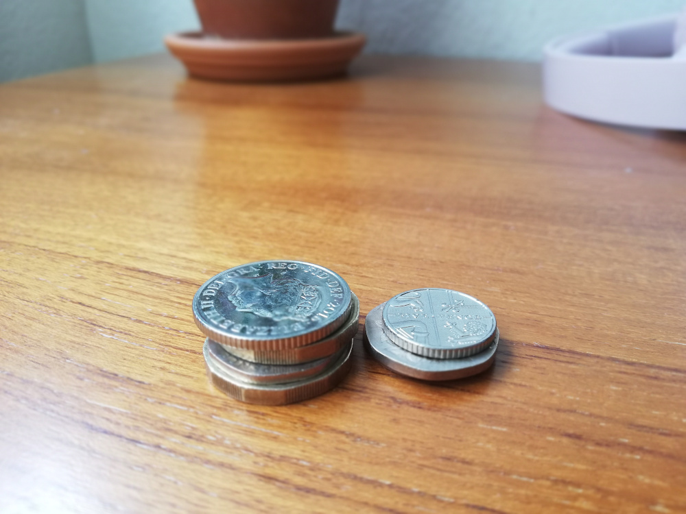

# Coin Change API


<!-- TABLE OF CONTENTS -->
<details open="open">
  <summary>Table of Contents</summary>
  <ol>
    <li>
      <a href="#about-the-project">About The Project</a>
      <ul>
        <li><a href="#design-decisions">Design Decisions</a></li>
        <li><a href="#coin-api-methods">Coin API Methods</a></li>
      </ul>
    </li>
    <li>
      <a href="#getting-started">Getting Started</a>
      <ul>
        <li><a href="#requirements">Requirements</a></li>
        <li><a href="#installation">Installation</a></li>
      </ul>
    </li>
    <li><a href="#usage">Usage</a></li>
    <li><a href="#roadmap">Roadmap</a></li>
    <li><a href="#license">License</a></li>
    <li><a href="#contact">Contact</a></li>
    <li><a href="#acknowledgements">Acknowledgements</a></li>
  </ol>
</details>


## About The Project

The project includes an API to calculate and keep Coin change for a vending machine and an interactive test harness to play with it.

### Design Decisions

The Coin API solves the following problems:
* Initialise the vending machine to a known state with given coins:
This solved by keeping coins in a HashMap in the Coin API. HashMap has complexity of O(1) for insertion and lookup. Because of this reason it is preferred.
* Register coins that have been deposited by a user:
Coins from a user added into machine coins whilst user coins also saved separately in an array. The reason to keep user coins sperately is to return them back in case of a request results with an error. Not enough change, not enough user coins to buy etc.
* Return the correct change to a user as coins when an order is received:
Although a classic HashMap doesn't keep the order, Object is used as a HashMap and the order is preserved in small to bigger coin types.
To be able to find least number of coins for a change the hashmap order is reversed with reverse() method. The time complexity for reverse is O(n).
The correct change amount is searched by a loop. The time complexity for whole operation is O(n). The buy method returns the least amount of change if it is not possible to return change or user does not insert enough coins to buy, the method retuns error message and all the coins user inserted by using insert method.
<br><br>
### Coin API Methods 

| Method            	| Operation                                                     	| Parameter Name 	| Parameter Type                         	| Response Type                          	| Success        	| Error                       	|
|-------------------	|---------------------------------------------------------------	|----------------	|----------------------------------------	|----------------------------------------	|----------------	|-----------------------------	|
| initialiseMachine 	| Initializes the machine with given coins                      	| coins          	| `[{ type: Number,amount: Number }]` 	| `[{ type: Number,amount: Number }]` 	| -              	| -                           	|
| registerUserCoins 	| Accepts user coins in the machine                             	| coins          	| `[{ type: Number,amount: Number }]` 	| `[{ type: Number,amount: Number }]` 	| -              	| -                           	|
| buy               	| Returns the correct change and removes coins from the machine 	| amount         	| `Number`                              | `[{ type: Number,amount: Number }]` 	| Returns change 	| Returns all user coins back 	|
| printMachineCoins 	| Prints the contents of the machine                            	| -              	| -                                     | -                                     | -              	| -                           	|


<br><br>
## Getting Started

### Requirements

The project works on Node version 12.x and greater. Before installation make sure to have Node.js (>=12.0.0) installed.

### Installation

Run the following commands to install the project and start the Coin CLI.
```bash
git clone https://github.com/nilkrdg/coin-change.git

cd coin-change

npm install 

npm start
```
## Usage

The project includes an interactive test harness (CLI). 

You can list all CLI commands.
```bash
help
```
You can list details of a CLI command.
```bash
help init
```

To initialise the machine,
```bash
init --coin-types 1,2,5 --coin-amounts 2,4,2
```
To initialise the machine with short form,
```bash
init -ct 1,2,5 -ca 2,4,2
```

To insert coins into the machine,
```bash
insert --coin-types 1,2,5 --coin-amounts 2,4,2
```
To insert coins into the machine with short form,
```bash
insert -ct 1,2,5 -ca 2,4,2
```
---
**NOTE**
Please be aware of the number of coin types and the number of coin amounts must be equal!

---
<br>


To buy a product and receive correct change,
```bash
buy --amount 10
```

To buy a product and receive correct change with short form,
```bash
buy -a 10
```
### Coin CLI Commands

| Command 	| Arguments                                                 	| Arguments short form                 	| Operation                                                                                       	|
|---------	|-----------------------------------------------------------	|--------------------------------------	|-------------------------------------------------------------------------------------------------	|
| init    	| --coin-types numberArray <br> --coin-amounts numberArray  	| -ct numberArray <br> -ca numberArray 	| Initializes the machine with given coins.                                                       	|
| insert  	| --coin-types numberArray <br> --coin-amounts numberArray  	| -ct numberArray <br> -ca numberArray 	| Accepts user coins in the machine.                                                              	|
| buy     	| --amount number                                      	| -a  number                       	| Returns the correct change and removes coins from the machine.                                  	|
| help/h  	|                                                           	|                                      	| Prints the list of commands. If command name argument is present print details of that command. 	|
| quit/q  	|                                                           	|                                      	| Terminates the Coin CLI.                                                                        	|
